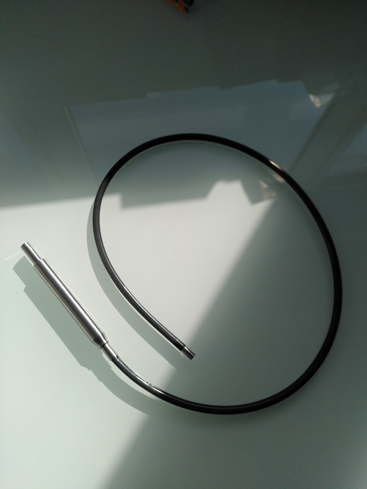
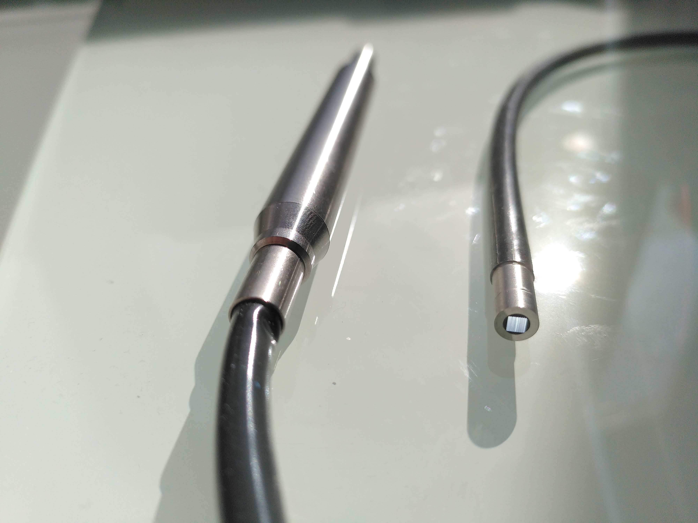
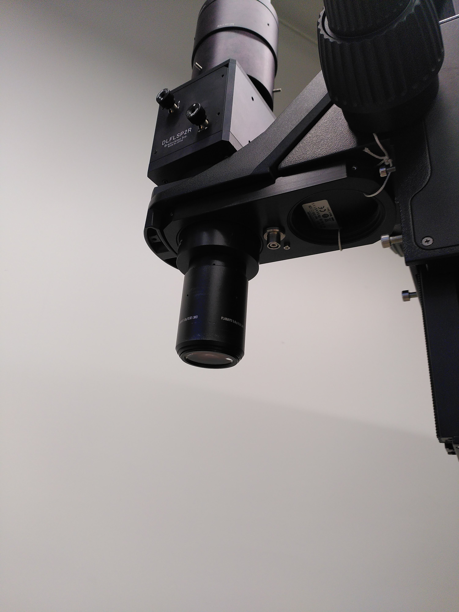
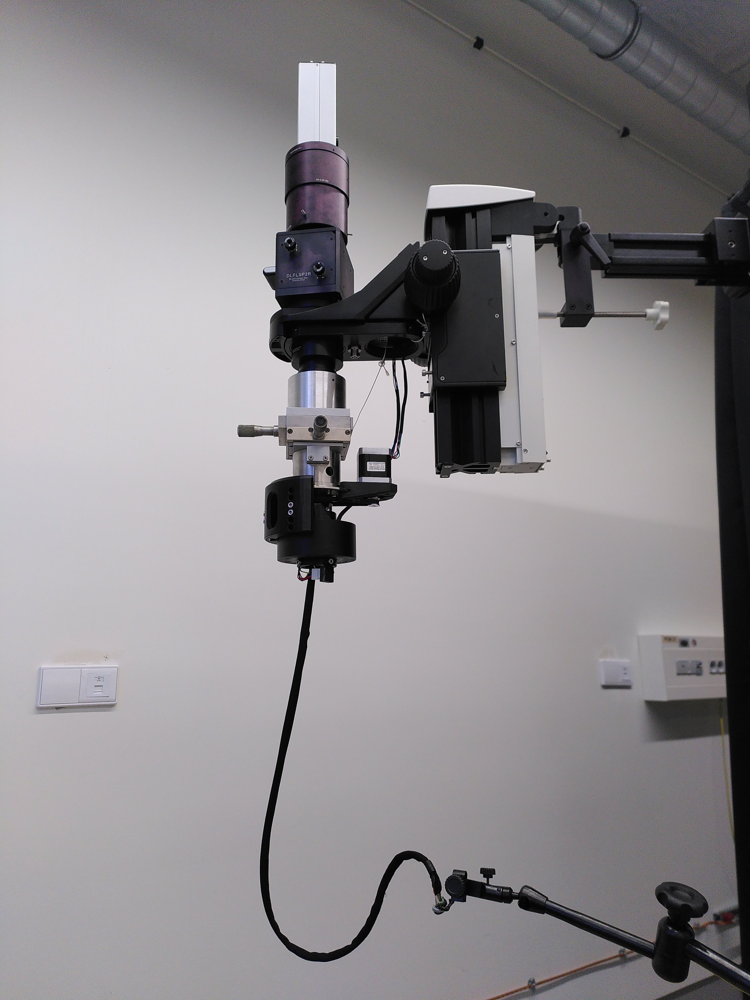
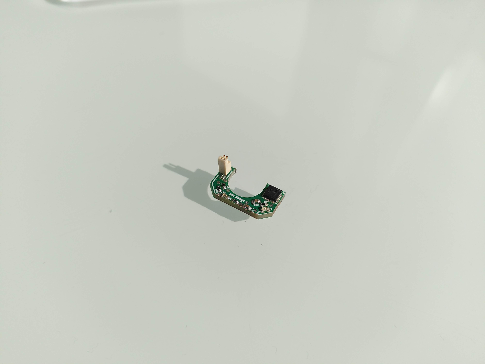
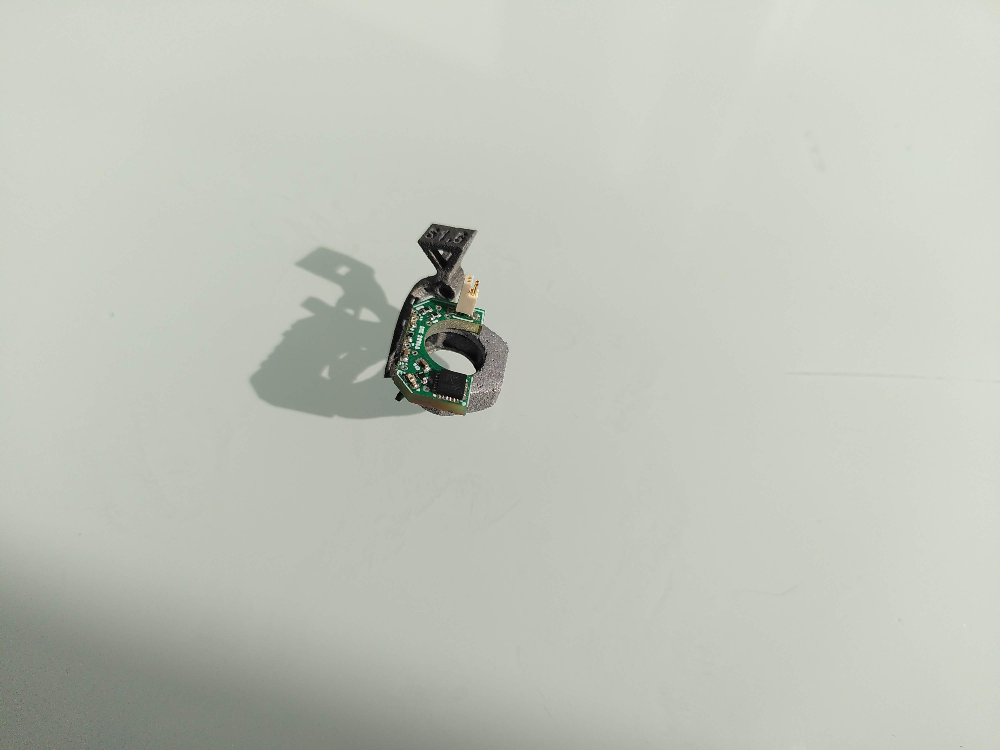
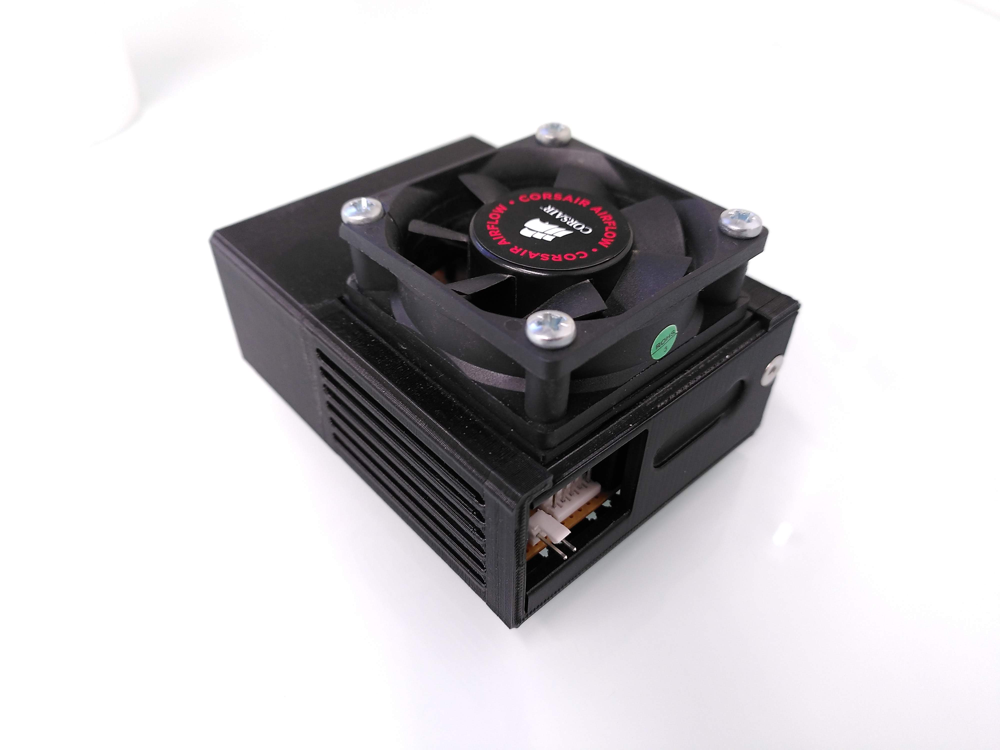

## Build Instructions :

There instructions are to reproduce the device with the files provided in this repository. However, it will be highly likely that you will need to make changes to the design to adapt for your particular situation (optical measurement setup available, dimenstions of the fiber bundle available)

### 1 - The fiber bundle :

The fiber bundle we used is designed by Schott, and is a large diameter (6.25 mm²) [wound image bundle](https://www.schott.com/en-ro/products/flexible-imaging-bundles-p1000343/product-variants?tab=large-diameter-image-guides).

  

    
  

  

    
  

 

### 2 - Adapting dimensions to the fiber and objective

  

    
  

  

    
  

#### From simple "fiber below lens" static mount

#### To rotative joint with adapted dimensions for fiber, motor, bearings & electrical joint

Planning ahead for a system to adjust focus (Z) and lateral shift (X, Y) with a 2d translation platform is quite handy and important.

### 3 - The inertial measurement unit board

  

    
  

  

    
  

### 4 - Electronic control

## 5 - User interface 